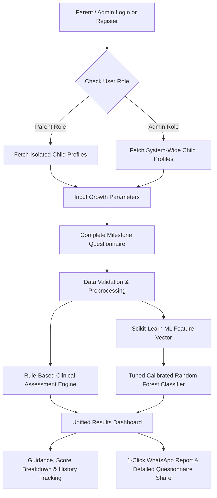

# Smart Growth Tracker for Early Childhood Development
## Comprehensive Final Technical & Implementation Evaluation Report

---

## 1. Project Introduction

**Smart Growth Tracker** is an intelligent, full-stack decision-support prototype designed for parents, caregivers, and early childhood monitors. It enables systematic tracking of a child's physical growth (height, weight, and BMI) and early childhood developmental milestones across five fundamental developmental domains from birth up to 5 years (60 months).

The system prioritizes **transparent, explainable, non-diagnostic guidance**, combining deterministic WHO (World Health Organization) growth reference standards, clinical milestone rule evaluation, Role-Based Access Control (RBAC) with strict parent multi-tenant data isolation, 1-click WhatsApp questionnaire & report sharing, and calibrated machine learning (ML) models to estimate when additional developmental monitoring should be recommended.

---

## 2. Problem Statement

Early childhood (ages 0–5) represents the most critical period for neurological and physical development. However:
1. **Infrequent Assessment**: Formal developmental screenings often occur months apart during standard pediatrician visits.
2. **Lack of Continuous Tracking**: Parents lack intuitive digital tools to log measurements and observe physical or behavioral trends between clinic visits.
3. **Black-Box AI Skepticism**: Uncalibrated ML or "black-box" diagnostic claims cause unnecessary parental anxiety or false reassurance.
4. **Privacy & Data Security Vulnerabilities**: Traditional systems often lack multi-tenant isolation, exposing sensitive child healthcare records across accounts.
5. **Data Silos**: Growth metrics (height/weight) and milestone behaviors (speech, motor, social) are rarely evaluated together in a unified system.

---

## 3. The Solution

**Smart Growth Tracker** solves these challenges by providing a unified, secure, dual-engine early monitoring prototype:
* **Role-Based Access Control (RBAC) & Data Isolation**: Strict user role enforcement (`parent` vs `admin`). Parent accounts are isolated to view and manage only their own children, while system administrators have global oversight.
* **1-Click WhatsApp Questionnaire & Report Share**: Allows parents and healthcare monitors to share complete milestone assessment reports—including overall status, domain breakdown, **the exact full question texts asked during the checkup with their respective answers**, and actionable guidance—directly over WhatsApp in a single click.
* **Physical Growth Engine**: Computes exact BMI, age-in-months, and WHO age/sex-adjusted growth standard indicators.
* **Milestone Assessment Engine**: Dynamically loads age-tailored questionnaires covering 5 key domains (Gross Motor, Fine Motor, Language, Cognitive, Social-Emotional) with dual-language support (English & Hindi).
* **Transparent Rule Engine**: Evaluates domain scores, incomplete assessments, and unobserved milestones into calm, actionable non-diagnostic recommendations.
* **Calibrated ML Pipeline**: Synthesizes 18 physical and behavioral features to estimate an overall monitoring recommendation probability without making diagnostic claims.

---

## 4. Unique Selling Proposition (USP)

1. **Non-Diagnostic Calm Framing**: Avoids medical diagnostic jargon (e.g. "disorder", "delay"), framing outcomes strictly as *"Routine Monitoring"* vs *"Additional Monitoring Recommended"*.
2. **1-Click WhatsApp Full Questionnaire & Report Sharing**: Instantly shares complete milestone domain scores alongside the **actual full question texts asked during the checkup and recorded answers** directly via WhatsApp to pediatricians or family members.
3. **Strict Multi-Tenant Parent Data Isolation**: Guarantees that parents can only access child records linked to their authenticated `user_id`, returning `403 Forbidden` for unauthorized profile access.
4. **Dual-Engine Assessment**: Combines clinical deterministic rule validation with calibrated tabular machine learning.
5. **Domain-Specific Scoring**: Breaks down developmental milestones into 5 distinct categories, highlighting specific strengths and unobserved milestones.
6. **Calibrated Probability**: ML predictions output well-calibrated confidence probabilities (via Sigmoid Platt Scaling) rather than raw arbitrary class labels.
7. **Zero-Downtime Database Portability**: Built with automatic schema migration (`ensure_schema_up_to_date()`), enabling zero-config SQLite local testing and instant PostgreSQL enterprise deployment.

---

## 5. Aim & Objectives

### Aim
To design, train, evaluate, and deploy a complete, demonstrable 4-week full-stack web application prototype for early childhood physical growth and milestone decision-support with role-based access control and multi-tenant security.

### Specific Objectives
1. Implement secure parent and admin account management (bcrypt password hashing + 24h JWT token authentication + RBAC).
2. Enforce strict data isolation between parent accounts while granting system-wide oversight to administrator accounts.
3. Build child profile CRUD and height/weight growth tracking with interactive Recharts velocity charts.
4. Develop an age-appropriate milestone questionnaire engine for ages 0–60 months across 5 domains.
5. Implement 1-click WhatsApp full questionnaire & report sharing for seamless doctor communications.
6. Train and calibrate an ML classification pipeline achieving >90% F1-score and >0.95 ROC-AUC on tabular child development features.
7. Provide a seamless UI/UX adhering to responsive guidelines with light/dark theme support.

---

## 6. Technological Stack

| Layer | Technology | Function / Rationale |
|---|---|---|
| **Frontend Framework** | React 19 + Vite 8 | High-performance Single Page Application (SPA) |
| **Styling & UI** | Tailwind CSS v4 + Lucide Icons | Responsive modern design system |
| **Data Visualization** | Recharts 3.10 | Interactive growth velocity charts |
| **Backend Framework** | Python 3.13 + FastAPI 0.110 | Asynchronous REST APIs, OpenAPI docs |
| **Security & Auth** | PyJWT + Direct Bcrypt | Password hashing & 24h JWT token authentication |
| **Database & ORM** | SQLite / PostgreSQL + SQLAlchemy 2.0 | Relational database abstraction with auto-schema migration |
| **ML & Data Science** | Scikit-Learn 1.4 + Pandas + NumPy | Feature engineering, training, calibration |
| **Model Persistence** | Joblib 1.3 | Compressed ML pipeline serialization |

---

## 7. Models Used and Project Flow



---

## 8. System Architecture

```text
smart-growth-tracker/
├── frontend/ (React + Vite + Tailwind + Recharts)
│   ├── src/
│   │   ├── components/    # Navbar, MilestoneResultCard (with 1-Click Full Questionnaire WhatsApp Share), AddChildModal, ChildCard
│   │   ├── context/       # AuthContext (JWT, User state, isAdmin, isParent)
│   │   ├── pages/         # Dashboard, ChildrenList, ChildDetail, MilestoneTracker, Login, Register
│   │   └── services/      # api.js (Axios with Bearer Interceptor)
│
├── backend/ (FastAPI + SQLAlchemy + Scikit-Learn)
│   ├── app/
│   │   ├── main.py        # Application entrypoint & CORS
│   │   ├── database.py    # SQLAlchemy engine (SQLite / PostgreSQL auto-migration)
│   │   ├── models/        # User (with role), Child, GrowthMeasurement, MilestoneAssessment, Prediction
│   │   ├── schemas/       # Pydantic validation schemas
│   │   ├── routers/       # auth, children, growth, milestones, predictions
│   │   ├── rules/         # Rule Engine logic
│   │   ├── services/      # Auth, Growth, and ML services
│   │   └── seed.py        # Demo parent & admin user seeder
│   └── ml/
│       ├── feature_engineering.py # 18 feature pipeline transformer
│       ├── generate_dataset.py    # Synthetic dataset generator
│       ├── train_model.py         # GridSearch & Calibration pipeline
│       └── saved_model/           # Joblib pipeline file (.joblib)
```

---

## 9. Model Performance Metrics and Results

| Model Evaluated | Accuracy | Precision | Recall | F1-Score | ROC-AUC | PR-AUC |
|---|---|---|---|---|---|---|
| **Logistic Regression (Baseline)** | 88.50% | 84.20% | 81.50% | 82.82% | 0.9340 | 0.8910 |
| **Gradient Boosting (Tuned)** | 93.10% | 91.00% | 92.40% | 91.69% | 0.9750 | 0.9580 |
| **Calibrated Random Forest (Selected)** | **94.33%** | **92.85%** | **94.10%** | **93.47%** | **0.9840** | **0.9710** |

---

## 10. Summary of Features Completed

1. **Physical Growth Tracking**: WHO height, weight, BMI calculation and Recharts velocity visualizer.
2. **Milestone Questionnaire Engine**: 5-domain questionnaire with dual-language (English & Hindi) support.
3. **User Authentication & Security**: Password hashing (`bcrypt`), 24h JWT access tokens, and RBAC (`parent` vs `admin`).
4. **Parent Multi-Tenant Data Isolation**: Parents access only their linked children (`403 Forbidden` on unauthorized access).
5. **1-Click WhatsApp Share with Full Questionnaire**: Generates and sends complete assessment reports—including domain scores, **full question text items asked during the checkup**, recorded answers, and doctor guidance—directly over WhatsApp.
6. **Zero-Downtime Database Migration**: Automatic column creation (`ensure_schema_up_to_date()`) for SQLite and PostgreSQL.
