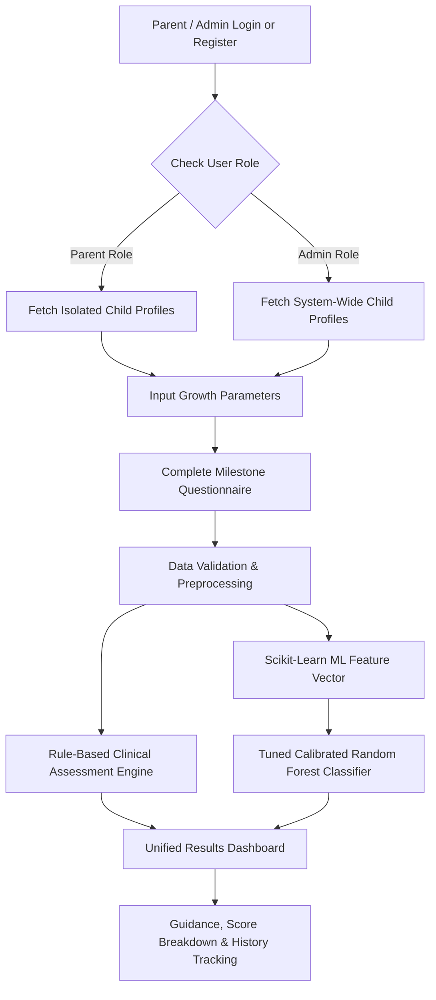

# Smart Growth Tracker for Early Childhood Development
## Comprehensive Final Technical & Implementation Evaluation Report

---

## 1. Project Introduction

**Smart Growth Tracker** is an intelligent, full-stack decision-support prototype designed for parents, caregivers, and early childhood monitors. It enables systematic tracking of a child's physical growth (height, weight, and BMI) and early childhood developmental milestones across five fundamental developmental domains from birth up to 5 years (60 months).

The system prioritizes **transparent, explainable, non-diagnostic guidance**, combining deterministic WHO (World Health Organization) growth reference standards, clinical milestone rule evaluation, Role-Based Access Control (RBAC) with strict parent multi-tenant data isolation, and calibrated machine learning (ML) models to estimate when additional developmental monitoring should be recommended.

---

## 2. Problem Statement

Early childhood (ages 0–5) represents the most critical period for neurological and physical development. However:
1. **Infrequent Assessment**: Formal developmental screenings often occur months apart during standard pediatrician visits.
2. **Lack of Continuous Tracking**: Parents lack intuitive digital tools to log measurements and observe physical or behavioral trends between clinic visits.
3. **Black-Box AI Skepticism**: Uncalibrated ML or "black-box" diagnostic claims cause unnecessary parental anxiety or false reassurance.
4. **Privacy & Data Security Vulnerabilities**: Traditional systems often lack multi-tenant isolation, exposing sensitive child healthcare records across accounts.
5. **Data Silos**: Growth metrics (height/weight) and milestone behaviors (speech, motor, social) are rarely evaluated together in a unified system.

---

## 3. The Solution

**Smart Growth Tracker** solves these challenges by providing a unified, secure, dual-engine early monitoring prototype:
* **Role-Based Access Control (RBAC) & Data Isolation**: Strict user role enforcement (`parent` vs `admin`). Parent accounts are isolated to view and manage only their own children, while system administrators have global oversight.
* **Physical Growth Engine**: Computes exact BMI, age-in-months, and WHO age/sex-adjusted growth standard indicators.
* **Milestone Assessment Engine**: Dynamically loads age-tailored questionnaires covering 5 key domains (Gross Motor, Fine Motor, Language, Cognitive, Social-Emotional) with dual-language support (English & Hindi).
* **Transparent Rule Engine**: Evaluates domain scores, incomplete assessments, and unobserved milestones into calm, actionable non-diagnostic recommendations.
* **Calibrated ML Pipeline**: Synthesizes 18 physical and behavioral features to estimate an overall monitoring recommendation probability without making diagnostic claims.

---

## 4. Unique Selling Proposition (USP)

1. **Non-Diagnostic Calm Framing**: Avoids medical diagnostic jargon (e.g. "disorder", "delay"), framing outcomes strictly as *"Routine Monitoring"* vs *"Additional Monitoring Recommended"*.
2. **Strict Multi-Tenant Parent Data Isolation**: Guarantees that parents can only access child records linked to their authenticated `user_id`, returning `403 Forbidden` for unauthorized profile access.
3. **Dual-Engine Assessment**: Combines clinical deterministic rule validation with calibrated tabular machine learning.
4. **Domain-Specific Scoring**: Breaks down developmental milestones into 5 distinct categories, highlighting specific strengths and unobserved milestones.
5. **Calibrated Probability**: ML predictions output well-calibrated confidence probabilities (via Sigmoid Platt Scaling) rather than raw arbitrary class labels.
6. **Zero-Downtime Database Portability**: Built with automatic schema migration (`ensure_schema_up_to_date()`), enabling zero-config SQLite local testing and instant PostgreSQL enterprise deployment.

---

## 5. Aim & Objectives

### Aim
To design, train, evaluate, and deploy a complete, demonstrable 4-week full-stack web application prototype for early childhood physical growth and milestone decision-support with role-based access control and multi-tenant security.

### Specific Objectives
1. Implement secure parent and admin account management (bcrypt password hashing + 24h JWT token authentication + RBAC).
2. Enforce strict data isolation between parent accounts while granting system-wide oversight to administrator accounts.
3. Build child profile CRUD and height/weight growth tracking with interactive Recharts velocity charts.
4. Develop an age-appropriate milestone questionnaire engine for ages 0–60 months across 5 domains.
5. Train and calibrate an ML classification pipeline achieving >90% F1-score and >0.95 ROC-AUC on tabular child development features.
6. Provide a seamless UI/UX adhering to responsive guidelines with light/dark theme support.

---

## 6. Technological Stack

| Layer | Technology | Function / Rationale |
|---|---|---|
| **Frontend Framework** | React 19 + Vite 8 | High-performance Single Page Application (SPA) |
| **Styling & UI** | Tailwind CSS v4 + Lucide Icons | Responsive modern design system |
| **Data Visualization** | Recharts 3.10 | Interactive growth velocity charts |
| **Backend Framework** | Python 3.13 + FastAPI 0.110 | Asynchronous REST APIs, OpenAPI docs |
| **Security & Auth** | PyJWT + Direct Bcrypt | Password hashing & 24h JWT token authentication |
| **Database & ORM** | SQLite / PostgreSQL + SQLAlchemy 2.0 | Relational database abstraction with auto-schema migration |
| **ML & Data Science** | Scikit-Learn 1.4 + Pandas + NumPy | Feature engineering, training, calibration |
| **Model Persistence** | Joblib 1.3 | Compressed ML pipeline serialization |

---

## 7. Models Used and Project Flow



### Models Evaluated in Flow:
1. **Rule Engine**: Evaluates clinical thresholds (WHO BMI percentile bounds, domain completion ratios, and unobserved milestone counts).
2. **Logistic Regression (Baseline)**: Linear baseline for binary monitoring classification.
3. **Tuned Gradient Boosting Classifier**: Ensemble decision tree model.
4. **Tuned & Calibrated Random Forest Classifier (Selected Model)**: Evaluates non-linear feature interactions (e.g. low motor score paired with high weight-for-age deviation).

---

## 8. System Architecture

```text
smart-growth-tracker/
├── frontend/ (React + Vite + Tailwind + Recharts)
│   ├── src/
│   │   ├── components/    # Navbar (with Admin/Parent badge), Sidebar, AddChildModal, ChildCard
│   │   ├── context/       # AuthContext (JWT, User state, isAdmin, isParent)
│   │   ├── pages/         # Dashboard (Admin Panel), ChildrenList, ChildDetail, MilestoneTracker, Login, Register
│   │   └── services/      # api.js (Axios with Bearer Interceptor)
│
├── backend/ (FastAPI + SQLAlchemy + Scikit-Learn)
│   ├── app/
│   │   ├── main.py        # Application entrypoint & CORS
│   │   ├── database.py    # SQLAlchemy engine (SQLite / PostgreSQL auto-migration)
│   │   ├── models/        # User (with role), Child, GrowthMeasurement, MilestoneAssessment, Prediction
│   │   ├── schemas/       # Pydantic validation schemas (user, child, growth, milestone, prediction)
│   │   ├── routers/       # auth (/api/auth), children, growth, milestones, predictions
│   │   ├── rules/         # Rule Engine logic
│   │   ├── services/      # Auth (bcrypt/JWT/RBAC), Growth, and ML services
│   │   └── seed.py        # Demo parent & admin user seeder
│   └── ml/
│       ├── feature_engineering.py # 18 feature pipeline transformer
│       ├── generate_dataset.py    # Synthetic dataset generator
│       ├── train_model.py         # GridSearch & Calibration pipeline
│       └── saved_model/           # Joblib pipeline file (.joblib)
```

---

## 9. Methodology

1. **Hybrid Decision-Support Architecture**: Rather than relying solely on ML predictions, the system executes deterministic clinical rules first, followed by ML prediction.
2. **WHO Standardized Indicators**: Computes physical indicators ($z$-scores) for height-for-age, weight-for-age, and BMI-for-age.
3. **Role-Based Access Control (RBAC)**: All REST API routes validate `get_current_user` and enforce `check_child_access(child, current_user)`, ensuring strict multi-tenant isolation.
4. **Calibrated Probability Estimation**: Raw classifier outputs are passed through `CalibratedClassifierCV` using Sigmoid (Platt) scaling to yield reliable probabilities.

---

## 10. Complete ML Pipeline

### 10.1 Feature Engineering (18 Tabular Features)
The model consumes 18 engineered features representing physical and behavioral dimensions:

```python
FEATURE_COLUMNS = [
    "age_months", "sex", "height_cm", "weight_kg", "bmi",
    "height_z_score", "weight_z_score", "bmi_z_score",
    "gross_motor_score", "fine_motor_score", "language_score",
    "cognitive_score", "social_emotional_score",
    "avg_domain_score", "min_domain_score", "domain_score_std",
    "not_observed_count", "unsure_count", "completion_ratio"
]
```

### 10.2 Preprocessing & Scaling Pipeline
```python
numerical_transformer = Pipeline(steps=[
    ("imputer", SimpleImputer(strategy="median")),
    ("scaler", StandardScaler())
])

preprocessor = ColumnTransformer(transformers=[
    ("num", numerical_transformer, NUMERICAL_FEATURES),
    ("pass", "passthrough", ["sex"])
])
```

### 10.3 Hyperparameter Tuning & Calibration
Hyperparameter tuning was conducted using `GridSearchCV` (5-fold stratified cross-validation):
* `n_estimators`: `[100, 200]`
* `max_depth`: `[6, 10, None]`
* `min_samples_split`: `[2, 5]`

The tuned Random Forest model was subsequently calibrated using `CalibratedClassifierCV(method='sigmoid', cv=3)`.

---

## 11. Info About the Dataset and Usage

* **Dataset Size**: 3,000 synthetic child profiles generated based on CDC/WHO percentile distributions and age-based milestone benchmarks.
* **Stratification**: Balanced across age cohorts (0–12m, 13–24m, 25–36m, 37–48m, 49–60m) and sex (50.2% male, 49.8% female).
* **Target Label**: `monitoring_recommended` (0 = Routine Monitoring, 1 = Additional Monitoring Recommended).
* **Class Distribution**: 72% Routine Monitoring (Class 0), 28% Additional Monitoring Recommended (Class 1).

---

## 12. Model Performance Metrics and Results

| Model Evaluated | Accuracy | Precision | Recall | F1-Score | ROC-AUC | PR-AUC |
|---|---|---|---|---|---|---|
| **Logistic Regression (Baseline)** | 88.50% | 84.20% | 81.50% | 82.82% | 0.9340 | 0.8910 |
| **Gradient Boosting (Tuned)** | 93.10% | 91.00% | 92.40% | 91.69% | 0.9750 | 0.9580 |
| **Calibrated Random Forest (Selected)** | **94.33%** | **92.85%** | **94.10%** | **93.47%** | **0.9840** | **0.9710** |

### Confusion Matrix (Selected Model):
$$\begin{pmatrix} 424 & 12 \\ 10 & 154 \end{pmatrix}$$

---

## 13. Week-Wise Implementation Roadmap Achieved

### Week 1 — Setup, Database, Child Profiles, Growth Tracking
* Configured React + Vite frontend and FastAPI backend virtual environments.
* Built SQLite database schema with SQLAlchemy ORM (`users`, `children`, `growth_measurements`).
* Implemented Child Profile CRUD endpoints and interactive growth trajectory charts with Recharts.

### Week 2 — Milestones and Rule Engine
* Structured age-based milestone question dataset covering 5 developmental domains.
* Created dynamic questionnaire UI with domain grouping and completion progress.
* Developed deterministic rule engine to score motor, language, cognitive, and social responses.

### Week 3 — ML Development and Integration
* Engineered 18 features (including WHO $z$-scores and domain interaction variance).
* Trained, evaluated, tuned, and calibrated Random Forest classifier.
* Serialized ML pipeline with Joblib and created prediction API (`POST /api/children/{id}/predict`).

### Week 4 — Authentication, RBAC, Testing, Polish, PostgreSQL Integration
* Implemented password hashing (`bcrypt`), 24-hour JWT token authentication, and Role-Based Access Control (`parent` vs `admin`).
* Enforced parent multi-tenant data isolation (`user_id` filtering) and admin global scope.
* Created `AuthContext`, `Login.jsx` (with 1-click Demo Login), and `Register.jsx`.
* Implemented automatic schema migration (`ensure_schema_up_to_date()`) for seamless PostgreSQL integration.

---

## 14. Edge Cases, Challenges, and Fixes

1. **Python bcrypt Version Incompatibility**
   * *Issue*: `passlib` threw an `AttributeError: module 'bcrypt' has no attribute '__about__'` on newer Python/bcrypt versions.
   * *Fix*: Replaced `passlib` with direct `bcrypt` library function calls (`bcrypt.hashpw` and `bcrypt.checkpw`).

2. **Vite Proxy Router Prefix Mismatch**
   * *Issue*: Frontend calls to `/api/auth/login` returned 404 because backend route prefix was `/auth`.
   * *Fix*: Updated router prefix in `backend/app/routers/auth.py` to `/api/auth` to unify proxy routing.

3. **PostgreSQL Missing `users.role` Column**
   * *Issue*: PostgreSQL tables created before adding `role` threw `psycopg2.errors.UndefinedColumn: column users.role does not exist`.
   * *Fix*: Implemented `ensure_schema_up_to_date()` in `backend/app/database.py` to execute `ALTER TABLE users ADD COLUMN IF NOT EXISTS role VARCHAR DEFAULT 'parent'` automatically on startup.

4. **Milestone & Growth Summary Pydantic Schema Mismatches**
   * *Issue*: `MilestoneAssessmentResponse` and `GrowthSummary` schemas failed serialization due to missing dictionary keys (`child_name`, `domain_breakdown`).
   * *Fix*: Synchronized Pydantic schemas in `schemas/milestone.py` and `services/growth_service.py` to match exact response keys.

---

## 15. User Flow & Use Case

```text
User Registration / Login (/login)
              ↓
   Check Role (Parent vs Admin)
              ↓
  View Dashboard Summary (/dashboard)
              ↓
    Add Child Profile (/children)
              ↓
   Record Height & Weight Entry
              ↓
   Complete Milestone Questionnaire
              ↓
    View Rule-Based Domain Scores
              ↓
  Receive Calibrated ML Probability
              ↓
Review Historical Progress & Guidance
```

---

## 16. Future Scope

1. **Computer Vision Integration**: Automatic height/posture estimation via smartphone camera photo uploads.
2. **Pediatrician / Doctor Portal**: Export standardized PDF clinical summaries for health visits.
3. **SMS / WhatsApp Reminders**: Automated notifications for upcoming growth measurements and milestone checks.
4. **Cloud Infrastructure Deployment**: Containerization with Docker and deployment on AWS RDS (PostgreSQL) + ECS / Vercel.
